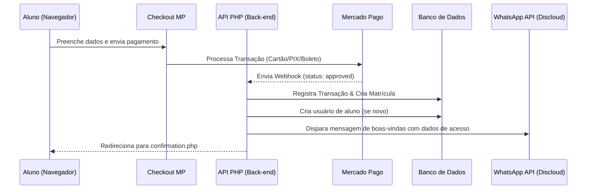
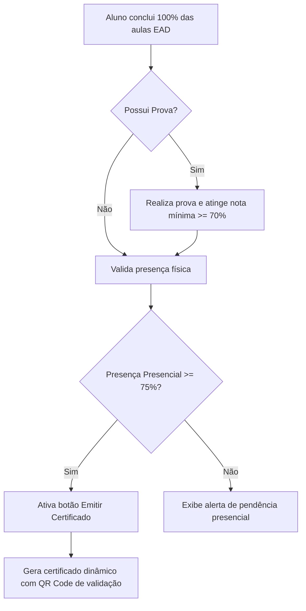

# PLANEJAMENTO MASTER — GT CURSOS
## Identidade Visual: Neon Amber Fusion (Obsidian Gold)
## Project ID: projects/13781069641496636350

Este é o documento de planejamento oficial e definitivo para o desenvolvimento da plataforma híbrida de ensino EAD + presencial **GT Cursos**. Todo o sistema deve ser construído sobre este planejamento estratégico, mantendo consistência com as especificações do PRD e o design visual aprovado no Stitch.

---

## 1. Skill Selecionada
- **UI Architecture** (Arquitetura e consistência visual baseada no design Stitch)
- **UX Systems** (Experiência do usuário de alto padrão cinematográfico e streaming)
- **PHP Backend Engineering** (Desenvolvimento de APIs modulares e seguras em PHP 8+)
- **Database Architecture** (Modelagem de dados MySQL otimizada e relacional)
- **Payment Integration** (Integração transparente com a API do Mercado Pago)
- **QA Testing** (Protocolos rigorosos de testes automatizados e manuais)
- **Browser DevTools Validation** (Validação técnica de console, rede e performance)

---

## 2. Estrutura Completa do Sistema

### 2.1 Mapeamento de Páginas (Frontend & Painéis)

#### Área Pública (Landing Page e Vendas)
1. **Landing Page (`index.php`)**: Apresentação da marca, catálogo de cursos híbridos (estilo streaming), depoimentos, FAQ e rodapé com SEO técnico.
2. **Detalhes do Curso (`course-details.php?id={id}`)**: Descrição profunda do curso, cronograma das aulas presenciais e online, currículo de módulos, preço e botão de inscrição direta.
3. **Checkout Premium (`checkout.php?id={id}`)**: Formulário de pagamento transparente de alta conversão (PIX, Cartão de Crédito e Boleto) integrado ao Mercado Pago.
4. **Confirmação de Compra (`confirmation.php`)**: Tela de parabéns pós-pagamento com instruções imediatas de acesso e dados do pedido.

#### Autenticação
5. **Login (`login.php`)**: Autenticação em Dark Mode absoluto com efeitos translúcidos.
6. **Registro (`register.php`)**: Cadastro de novos alunos integrado ao fluxo de checkout.
7. **Recuperação de Senha (`recover.php`)**: Fluxo com envio de token seguro por e-mail via Gmail API.

#### Área do Aluno (Dashboard Aluno)
8. **Dashboard Principal (`dashboard/index.php`)**: Visão geral de cursos matriculados, progresso geral, estatísticas de gamificação (XP, nível, medalhas e streaks de presença) e notificações.
9. **Ambiente de Aula Cinematográfico (`dashboard/classroom.php?lesson_id={id}`)**: Interface imersiva estilo streaming. Possui barra lateral de módulos/aulas, player de vídeo Bunny.net com modo teatro, abas de descrição, materiais de apoio, comentários estruturados e notas pessoais.
10. **Perfil e Conquistas (`dashboard/profile.php`)**: Gerenciamento de dados cadastrais, visualização de certificados emitidos e galeria de medalhas conquistadas.

#### Área Administrativa (Dashboard Admin)
11. **Dashboard Geral (`admin/index.php`)**: Painel consolidado com métricas financeiras (MRR, vendas), analytics de engajamento (alunos ativos, progresso médio) e gráficos em tempo real.
12. **Gestão de Cursos (`admin/courses.php`)**: CRUD modular de cursos, módulos, matérias e aulas.
13. **Controle de Frequência (`admin/attendance.php`)**: Interface para registrar presença física de alunos em aulas presenciais.
14. **Editor Visual de Certificados (`admin/certificates.php`)**: Canvas interativo para fazer upload de fundos de certificados, posicionar textos dinâmicos, assinaturas digitais e gerar QR Codes de autenticidade.
15. **Suporte & Logs (`admin/support.php`)**: Central de tickets para atendimento de alunos e visualização de logs de auditoria do sistema.

---

### 2.2 Banco de Dados (MySQL)

A estrutura relacional contará com chaves estrangeiras (`FOREIGN KEY`) com ações de integridade (`ON DELETE CASCADE` onde aplicável) e índices nos campos de pesquisa mais frequentes (`email`, `status`, `course_id`).

#### Estrutura de Tabelas Principais:
- `users`: Armazena dados cadastrais, credenciais criptografadas (`bcrypt`), permissões (`admin` ou `student`) e métricas de gamificação (`xp`, `level`, `streak`).
- `courses`: Armazena dados de cursos (EAD, presencial ou híbrido), preços e status.
- `modules`: Divisão de cursos em módulos temáticos com controle de ordenação.
- `subjects`: Divisão interna de módulos em matérias.
- `lessons`: Conteúdo final (vídeos da Bunny.net, arquivos anexos, duração e descrição).
- `enrollments`: Matrículas ativas dos alunos vinculando cursos e usuários.
- `lesson_progress`: Registro em tempo real de segundos assistidos e status de conclusão.
- `physical_attendance`: Controle de chamadas de presença para aulas presenciais.
- `quizzes` & `questions` & `question_options` & `quiz_attempts`: Motor de testes teóricos vinculados a aulas ou cursos para validação de certificados.
- `certificates`: Códigos de verificação criptográfica e caminhos de arquivos de certificados emitidos.
- `transactions`: Log de pagamentos integrados ao Mercado Pago (ID da transação, forma de pagamento, valor e status da venda).
- `support_tickets` & `support_messages`: Gestão de chamados e conversas com a equipe de suporte.
- `audit_logs`: Logs de segurança do sistema (ações críticas, login, alteração de permissão, IP do usuário).

---

### 2.3 APIs REST (PHP Modular)

As APIs do sistema serão organizadas em pastas modulares sob a rota `/public/api/` e retornarão exclusivamente cabeçalhos `Content-Type: application/json`.

#### Módulos de API:
1. **API de Autenticação (`/api/auth/`)**:
   - `login.php` (POST): Autentica e inicia sessão segura.
   - `register.php` (POST): Cadastra novo usuário.
   - `recover.php` (POST): Dispara e-mail de recuperação.
2. **API do Aluno e Classroom (`/api/classroom/`)**:
   - `progress.php` (POST): Salva o tempo assistido e marca aula como concluída.
   - `comments.php` (GET/POST): Listagem e inserção de dúvidas na aula.
   - `notes.php` (GET/POST): Salva anotações individuais associadas ao timestamp do vídeo.
3. **API de Pagamentos (`/api/checkout/`)**:
   - `process.php` (POST): Recebe a requisição do formulário transparente do Mercado Pago e gera a transação.
   - `webhook.php` (POST): Recebe notificações automáticas de mudança de status de pagamento do Mercado Pago, ativando ou cancelando matrículas.
4. **API de Gamificação (`/api/gamification/`)**:
   - `stats.php` (GET): Retorna XP, medalhas e conquistas do aluno logado.
   - `leaderboard.php` (GET): Retorna ranking global dos alunos mais engajados.
5. **API Administrativa (`/api/admin/`)**:
   - `analytics.php` (GET): Consolida dados de faturamento e progresso geral.
   - `attendance.php` (POST): Registra presenças presenciais.
   - `courses.php` (POST/PUT/DELETE): Executa manipulações no catálogo.

---

### 2.4 Fluxos e Autenticação

#### Fluxo de Compra e Acesso:

#### Fluxo de Certificação Dinâmica:

---

### 2.5 Segurança

- **Prevenção SQL Injection**: Uso estrito de `PDO` com Prepared Statements em todas as operações de banco de dados.
- **Sanitização contra XSS**: Filtragem rigorosa de dados de entrada usando `filter_var()` e codificação de saídas HTML usando `htmlspecialchars()`.
- **Proteção CSRF**: Tokens criptográficos gerados e armazenados em `$_SESSION` para validar submissões de formulários via `POST`.
- **Controle de Acesso Rígido (RBAC)**: Middleware PHP que intercepta requisições de rotas protegidas e valida o nível do usuário (`role = 'admin'` para painel de gerência).
- **Rate Limit**: Registro de tentativas de login por IP no MySQL para bloquear requisições suspeitas após 5 falhas consecutivas durante 15 minutos.

---

### 2.6 Performance & SEO

- **Carregamento Otimizado (Lazy Loading)**: Imagens de thumbnails de cursos e avatares carregados com `loading="lazy"`.
- **Minificação e Cache**: Ativação de cache HTTP (`Cache-Control`) para assets estáticos e compressão `gzip` via arquivo `.htaccess` configurado para a HostGator.
- **Consultas Otimizadas**: Consultas SQL estruturadas com joins específicos e limitação de resultados para evitar estouro de memória da hospedagem compartilhada.
- **SEO Avançado**:
  - Títulos descritivos dinâmicos para cada página.
  - Implementação de dados estruturados (Schema.org do tipo `Course` e `EducationEvent` para cursos presenciais).
  - Configuração de tags Open Graph (`og:title`, `og:description`, `og:image`) para compartilhamento profissional em redes sociais.

---

## 3. Divisão em Fases

### Fase 1: Fundação & Banco de Dados (Database & Config)
- Criação dos arquivos `.rules` e `.workflows` permanentes do projeto.
- Instalação e configuração da estrutura de pastas MVC em PHP.
- Criação do script de banco de dados (`schema.sql`) e execução no phpMyAdmin.
- Desenvolvimento da classe de conexão singleton com PDO em `src/Config/Database.php`.

### Fase 2: APIs REST & Núcleo do Back-end
- Desenvolvimento dos controladores de autenticação (Login, Registro e Recuperação).
- Implementação dos middlewares de segurança (sessão, CSRF e cabeçalhos).
- Configuração do PHPMailer para integração de envio de emails com a Gmail API.
- Configuração da API do WhatsApp via Discloud.

### Fase 3: Front-end Premium (Landing Page & Dashboards)
- Transposição dos códigos HTML/Tailwind das páginas oficiais do Stitch (Landing Page, Login, Checkout e Recuperação).
- Integração do CSS Customizado (`custom.css`) contendo os gradientes amber escuros, os brilhos neon amber (`#F2C94C`) e as bordas translúcidas de glassmorphism.
- Construção responsiva e fluida garantindo compatibilidade mobile avançada.

### Fase 4: Ambiente de Aula & Player Bunny.net
- Desenvolvimento do ambiente de aula imersivo.
- Integração do player Bunny.net via iframe dinâmico responsivo.
- Programação dos scripts de progresso automático (`classroom.js`) que salvam a posição do vídeo do aluno via chamadas fetch na API PHP de forma síncrona.
- Abas interativas de materiais de apoio e sistema de comentários da aula.

### Fase 5: Checkout Transparente & Webhooks
- Conexão do SDK do Mercado Pago ao formulário de checkout transparente.
- Desenvolvimento do endpoint de processamento de pagamentos seguro.
- Criação do webhook oficial para escuta de notificações e ativação instantânea da matrícula no banco de dados.

### Fase 6: Sistema de Provas, Certificados & Gamificação
- Criação do motor de geração de quizzes com verificação de notas.
- Criação do Editor Visual de Certificados do admin usando HTML5 Canvas.
- Algoritmo de premiação de XP, gerenciamento de níveis de perfil e streaks diários por atividade e presença.

### Fase 7: QA, Otimização & Deploy HostGator
- Testes exaustivos usando DevTools (Console, Network, Responsividade).
- Otimização do carregamento e SEO técnico (auditoria via Lighthouse).
- Publicação de código via Git Version Control no cPanel da HostGator e configuração das tarefas cron para automatizações.

---
*Planejamento aprovado e em conformidade com as exigências técnicas da GT Cursos.*
